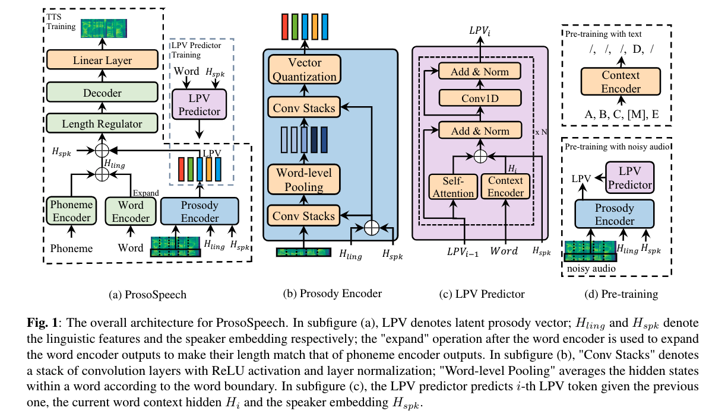

# ProsoSpeech

## Abstract

Expressive text-to-speech (TTS) has become a hot research topic recently, mainly focusing on modeling prosody in speech. Prosody modeling has several challenges: 1) the extracted pitch used in previous prosody modeling works have inevitable errors, which hurts the prosody modeling; 2) different attributes of prosody (e.g., pitch, duration and energy) are dependent on each other and produce the nature prosody together; and 3) due to high variability of prosody and the limited amount of high-quality data for TTS training, the distribution of prosody cannot be fully shaped. To tackle these issues, we propose ProsoSpeech, which enhances the prosody using quantized latent vectors pre-trained on large-scale unpaired and low-quality text and speech data. Specifically, we first introduce a word-level prosody encoder, which quantizes the low-frequency band of the speech and compresses prosody attributes in the latent prosody vector (LPV). Then we introduce an LPV predictor, which predicts LPV given word sequence. We pre-train the LPV predictor on large-scale text and low-quality speech data and fine-tune it on the high-quality TTS dataset. Finally, our model can generate expressive speech conditioned on the predicted LPV. Experimental results show that ProsoSpeech can generate speech with richer prosody compared with baseline methods.

We did not release the source codes since our model has been transferred to some products of the company.

  
## Authors

- Yi Ren (Zhejiang University), rayeren@zju.edu.cn
- Ming Lei (Speech Lab, Alibaba Group), lm86501@alibaba-inc.com
- Zhiying Huang (Speech Lab, Alibaba Group), zhiying.hzy@alibaba-inc.com
- Shiliang Zhang (Speech Lab, Alibaba Group)
- Qian Chen (Speech Lab, Alibaba Group) 
- Zhou Zhao (Zhejiang University)

## Audio Samples

1. 亨利街的北侧便是莎翁故居。
    <table style='width: 100%;'>
    <thead>
    <tr>
        <th></th>
        <th>GT</th>
        <th>GT(voc.)</th>
        <th>FastSpeech</th>
        <th>FastSpeech 2</th>
        <th>FastSpeech (joint)</th>
    </tr>
    </thead>
    <tbody>
    <tr>
        <th scope="row">wav</th>
        <td><audio controls="" ><source src="resources/audio/gt/4.mp3" type="audio/wav"></audio></td>
        <td><audio controls="" ><source src="resources/audio/gt_voc/4.mp3" type="audio/wav"></audio></td>
        <td><audio controls="" ><source src="resources/audio/fs/4.mp3" type="audio/wav"></audio></td>
        <td><audio controls="" ><source src="resources/audio/fs2/4.mp3" type="audio/wav"></audio></td>
        <td><audio controls="" ><source src="resources/audio/fs2_joint/4.mp3" type="audio/wav"></audio></td>
    </tr>
    </tbody>
    <thead>
    <tr>
        <th></th>
        <th>ProsoSpeech</th>
        <th>w/o text PT</th>
        <th>w/o audio PT</th>
        <th>w/o text/audio PT</th>
        <th></th>
    </tr>
    </thead>
    <tbody>
    <tr>
        <th scope="row">wav</th>
        <td><audio controls="" ><source src="resources/audio/main/4.mp3" type="audio/wav"></audio></td>
        <td><audio controls="" ><source src="resources/audio/wo_audio_pt/4.mp3" type="audio/wav"></audio></td>
        <td><audio controls="" ><source src="resources/audio/wo_audio_text_pt/4.mp3" type="audio/wav"></audio></td>
        <td><audio controls="" ><source src="resources/audio/wo_text_pt/4.mp3" type="audio/wav"></audio></td>
        <td></td>
    </tr>
    </tbody>
    </table>

2. 众所周知,潍坊因风筝而在全国闻名遐迩。
    <table style='width: 100%;'>
    <thead>
    <tr>
        <th></th>
        <th>GT</th>
        <th>GT(voc.)</th>
        <th>FastSpeech</th>
        <th>FastSpeech 2</th>
        <th>FastSpeech (joint)</th>
    </tr>
    </thead>
    <tbody>
    <tr>
        <th scope="row">wav</th>
        <td><audio controls="" ><source src="resources/audio/gt/5.mp3" type="audio/wav"></audio></td>
        <td><audio controls="" ><source src="resources/audio/gt_voc/5.mp3" type="audio/wav"></audio></td>
        <td><audio controls="" ><source src="resources/audio/fs/5.mp3" type="audio/wav"></audio></td>
        <td><audio controls="" ><source src="resources/audio/fs2/5.mp3" type="audio/wav"></audio></td>
        <td><audio controls="" ><source src="resources/audio/fs2_joint/5.mp3" type="audio/wav"></audio></td>
    </tr>
    </tbody>
    <thead>
    <tr>
        <th></th>
        <th>ProsoSpeech</th>
        <th>w/o text PT</th>
        <th>w/o audio PT</th>
        <th>w/o text/audio PT</th>
        <th></th>
    </tr>
    </thead>
    <tbody>
    <tr>
        <th scope="row">wav</th>
        <td><audio controls="" ><source src="resources/audio/main/5.mp3" type="audio/wav"></audio></td>
        <td><audio controls="" ><source src="resources/audio/wo_audio_pt/5.mp3" type="audio/wav"></audio></td>
        <td><audio controls="" ><source src="resources/audio/wo_audio_text_pt/5.mp3" type="audio/wav"></audio></td>
        <td><audio controls="" ><source src="resources/audio/wo_text_pt/5.mp3" type="audio/wav"></audio></td>
        <td></td>
    </tr>
    </tbody>
    </table>

3. 傻傻的乱叫，什么也不敢动。
    <table style='width: 100%;'>
    <thead>
    <tr>
        <th></th>
        <th>GT</th>
        <th>GT(voc.)</th>
        <th>FastSpeech</th>
        <th>FastSpeech 2</th>
        <th>FastSpeech (joint)</th>
    </tr>
    </thead>
    <tbody>
    <tr>
        <th scope="row">wav</th>
        <td><audio controls="" ><source src="resources/audio/gt/7.mp3" type="audio/wav"></audio></td>
        <td><audio controls="" ><source src="resources/audio/gt_voc/7.mp3" type="audio/wav"></audio></td>
        <td><audio controls="" ><source src="resources/audio/fs/7.mp3" type="audio/wav"></audio></td>
        <td><audio controls="" ><source src="resources/audio/fs2/7.mp3" type="audio/wav"></audio></td>
        <td><audio controls="" ><source src="resources/audio/fs2_joint/7.mp3" type="audio/wav"></audio></td>
    </tr>
    </tbody>
    <thead>
    <tr>
        <th></th>
        <th>ProsoSpeech</th>
        <th>w/o text PT</th>
        <th>w/o audio PT</th>
        <th>w/o text/audio PT</th>
        <th></th>
    </tr>
    </thead>
    <tbody>
    <tr>
        <th scope="row">wav</th>
        <td><audio controls="" ><source src="resources/audio/main/7.mp3" type="audio/wav"></audio></td>
        <td><audio controls="" ><source src="resources/audio/wo_audio_pt/7.mp3" type="audio/wav"></audio></td>
        <td><audio controls="" ><source src="resources/audio/wo_audio_text_pt/7.mp3" type="audio/wav"></audio></td>
        <td><audio controls="" ><source src="resources/audio/wo_text_pt/7.mp3" type="audio/wav"></audio></td>
        <td></td>
    </tr>
    </tbody>
    </table>

4. 努尔始终咬紧牙关，不哭也不说话。
    <table style='width: 100%;'>
    <thead>
    <tr>
        <th></th>
        <th>GT</th>
        <th>GT(voc.)</th>
        <th>FastSpeech</th>
        <th>FastSpeech 2</th>
        <th>FastSpeech (joint)</th>
    </tr>
    </thead>
    <tbody>
    <tr>
        <th scope="row">wav</th>
        <td><audio controls="" ><source src="resources/audio/gt/9.mp3" type="audio/wav"></audio></td>
        <td><audio controls="" ><source src="resources/audio/gt_voc/9.mp3" type="audio/wav"></audio></td>
        <td><audio controls="" ><source src="resources/audio/fs/9.mp3" type="audio/wav"></audio></td>
        <td><audio controls="" ><source src="resources/audio/fs2/9.mp3" type="audio/wav"></audio></td>
        <td><audio controls="" ><source src="resources/audio/fs2_joint/9.mp3" type="audio/wav"></audio></td>
    </tr>
    </tbody>
    <thead>
    <tr>
        <th></th>
        <th>ProsoSpeech</th>
        <th>w/o text PT</th>
        <th>w/o audio PT</th>
        <th>w/o text/audio PT</th>
        <th></th>
    </tr>
    </thead>
    <tbody>
    <tr>
        <th scope="row">wav</th>
        <td><audio controls="" ><source src="resources/audio/main/9.mp3" type="audio/wav"></audio></td>
        <td><audio controls="" ><source src="resources/audio/wo_audio_pt/9.mp3" type="audio/wav"></audio></td>
        <td><audio controls="" ><source src="resources/audio/wo_audio_text_pt/9.mp3" type="audio/wav"></audio></td>
        <td><audio controls="" ><source src="resources/audio/wo_text_pt/9.mp3" type="audio/wav"></audio></td>
        <td></td>
    </tr>
    </tbody>
    </table>
